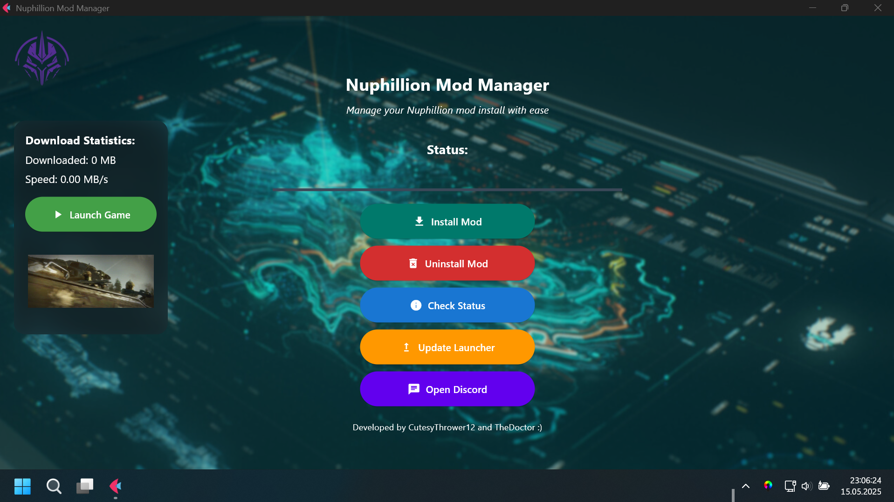
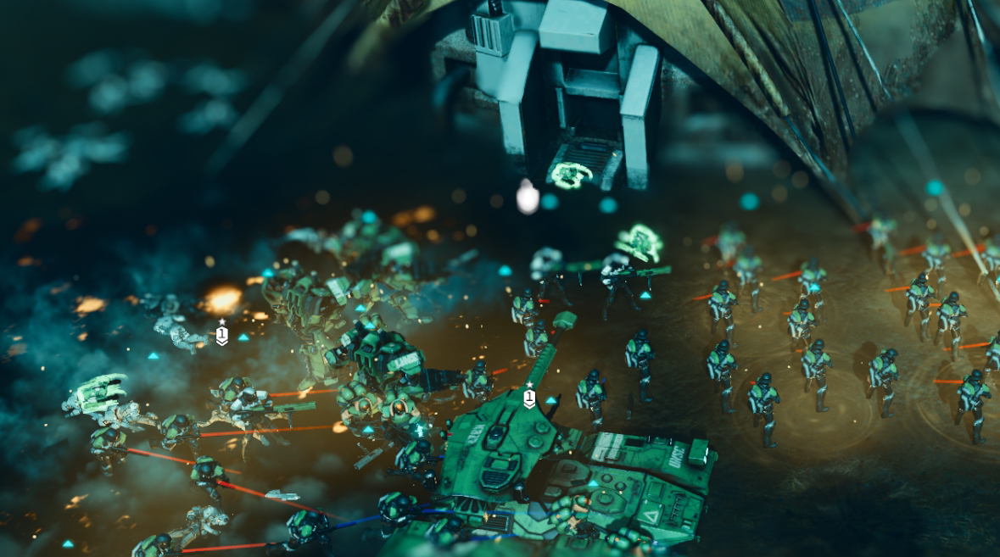
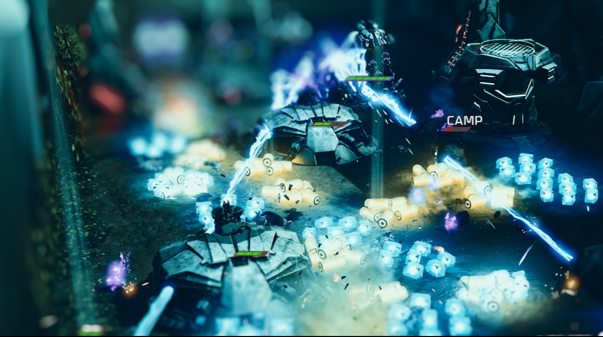

# NuphillionLauncher

A modern launcher for Halo Wars 2, focused on easy mod management and updates for the Nuphillion Mod.

---

## ✨ Features

- **One-click install/uninstall** of the Nuphillion Mod
- **Automatic update checks** and easy updating
- **Bandwidth and download statistics** with live preview
- **Game launch integration** dynamic HW2 Launcher + possible offline support for future via dll injection
- **Beautiful, modern UI** with mica win11 style
- **No admin rights required** for mod install/uninstall
- **Around 3 seconds startup time** reduced from ~4min 
---

## 📦 Installation

You can either build from source (windows) or use the precompiled Windows installer available on the [Releases Page](https://github.com/TheDoctor200/NuphillionLauncher/releases/latest).

```sh
pip install -r requirements.txt
python launcher.py
```

✅ **Windows only**

---

## 🖼️ App Preview (resizeable window)



---

## 🎨 Mod Preview Images

|  |  |  |
|:-------------------------------:|:-------------------------------:|:-----------------------------------:|
|         `IMG_3824.png`          |         `IMG_3796.png`          |         `frostBound.png`            |

---

## ℹ️ Details

- **Easy to use:** Simple, modern interface.
- **Safe:** No admin rights required for mod install/uninstall.
- **Actively maintained:** Check the [Releases Page](https://github.com/TheDoctor200/NuphillionLauncher/releases/latest) for updates.

---

## 🙏 Credits

- **CutesyThrower12** – Mod development
- **TheDoctor200** – Launcher development, update system, UI/UX

---

## 💸 Support future development & my work

 LTC Wallet: `0x4338665CBB7B2485A8855A139b75D5e34AB0DB94`  
 ETH Wallet: `0xfbe3E2337e7bCfC9245f0C2eAeF16597f0Bb2Dc2`

---

Enjoy modding Halo Wars 2 with **NuphillionLauncher**!
